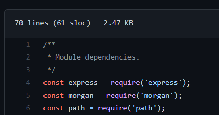

# Dev Query Resolver

## Coding Guidelines

- Keep the module dependencies as low as possible.
- Keep the module dependencies only on the top of the module.
- Only use the below format for the module dependencies.

  > 

- Use asynchonous functions for the query resulution from database.
- Use the below format for development environment.

> ```MONGO_USER=<your-username>
> MONGO_PASSWORD=<your-password>
> MONGO_HOST=cluster0.<ff>.mongodb.net
> MONGO_DATABASE=userdb
> PORT=8000
> ```
